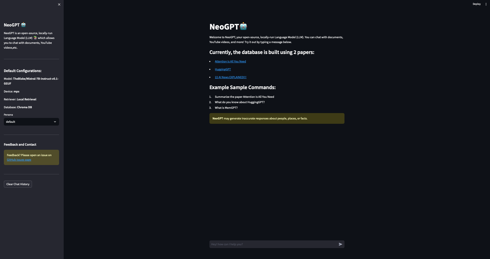

# __Run NeoGPT__ ⚡️


## CLI Usage
Run the CLI to start using NeoGPT. The below command will run NeoGPT with default options.

```bash title="Terminal"
python main.py 
```

!!! info "Note"
    On first run, NeoGPT will download the model from HuggingFace and build the database. This may take few minutes.

Once everything is set up, you will be greeted with the following message:


There are various options available to run the CLI. You can use the `--help` flag to view the available commands and options.

```bash title="Terminal"
python main.py --help
```

### CLI Options

1. `--ui`: You can use `--ui` flag to run the Streamlit UI.
```bash title="Terminal"
python main.py --ui
```

2. `--db`: You can also use `--db` flag to specify the database to use. Currently the supported databases are:
    - `Chroma` (default)
    
    - `FAISS`
```bash title="Terminal"
python main.py --db FAISS
```

3. `--persona`: You can also use `--persona` flag to specify the persona to use. Currently the supported personas are:

    - `DEFAULT`: An helpful assistant that will help you with your queries. (default)

    - `RECRUITER`: An experienced recruiter who finds the best candidates. 

    - `ACADEMICIAN`: Engages in in-depth research and presents findings. 

    - `FRIEND`: Provides comfort and encouragement as a friend. 

    - `ML_ENGINEER`: Explains complex ML concepts in an easy-to-understand manner.

    - `CEO`: Acts as the CEO, making strategic decisions. 

    - `RESEARCHER`: Analyzes, synthesizes, and provides insights. 
```bash title="Terminal"
python main.py --persona default
```

    !!! info "Note"
        Documentation for the personas is still in progress. We will update the documentation once it is ready.


4. `--retriever`: You can specify the retriever you want to use in the CLI. Currently the supported retrievers are:
    - Local Retriever (default)

    - Web Research Retriever (Requires Google API Key refer [here](/advance/search/))

    - Hybrid Retriever (Ensemble Retriever)

    - SQL Retriever (Experimental)

    - Context Compressor Retriever 
    
    - Stepback Prompting Retriever (RAG + DuckDuckGo Search + Stepback Prompting)
```bash title="Terminal"
python main.py --retriever local
```

    !!! info "Note"
        Documentation for the retrievers is still in progress. We will update the documentation once it is ready.

5. `--build`: You can use `--build` flag to build the database. This will build the database using the files in `neogpt/documents` folder. 
    Basically it will run the `builder.py` script. You can read more about the builder [here](/neogpt-docs/builder/).
```bash title="Terminal"
python main.py --build
```

6. `--show_source`: You can use `--show_source` flag to show the source of the retrieved document. This will show the documents that are retrieved from the database and fed into the LLM
```bash title="Terminal"
python main.py --show_source
```

## Streamlit UI

You can also use the Streamlit UI to interact with NeoGPT. To run the Streamlit UI, execute the following command in your terminal or command prompt:

```bash title="Terminal"
python main.py --ui
```

This will start the Streamlit UI in your browser, if it doesn't open automatically, you can open it manually by going to `http://localhost:8501` in your browser.




!!! warning "Note"
    The Streamlit UI is still in development. It only supports the `Local Retriever` for now.
    